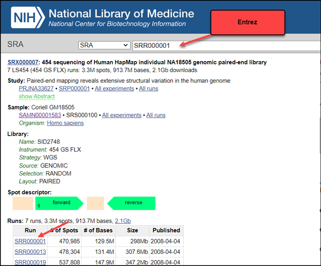
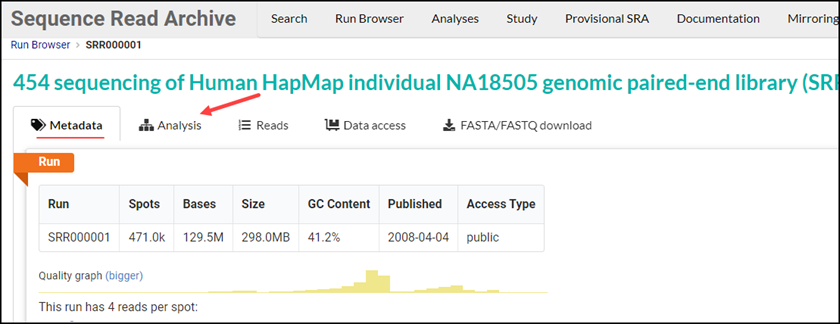
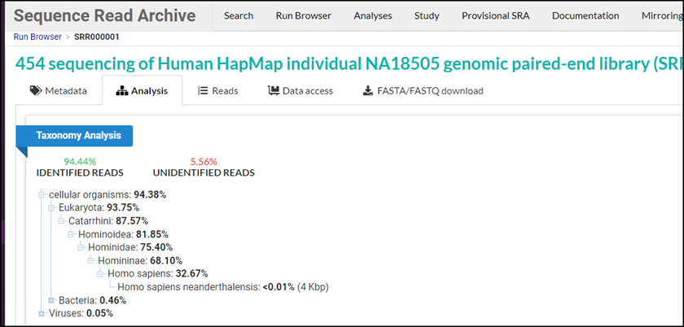
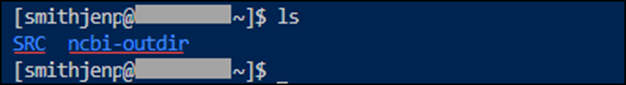
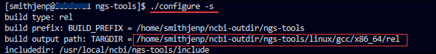
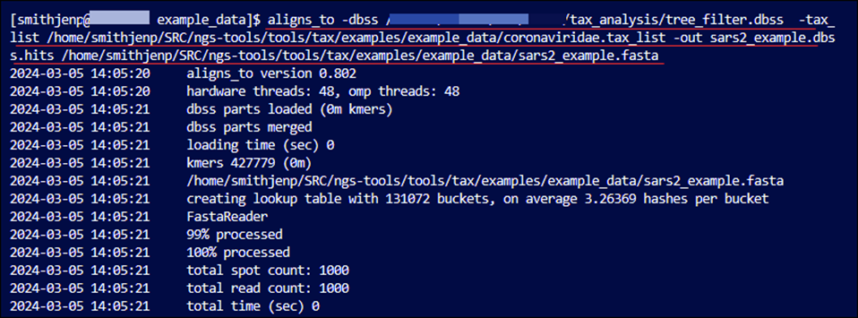
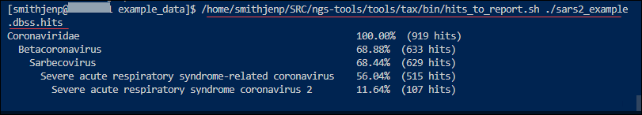

# STAT_Tool
This document provides instructions for using the NCBI SRA Taxonomy Analysis Tool (STAT).

## What is STAT? 

The NCBI SRA Taxonomy Analysis Tool (STAT) identifies the taxonomic distribution of reads from next generation sequencing runs. The tool maps individual sequencing reads to the taxonomic hierarchy and reports the taxonomic composition of reads within a sequencing run. 

When users submit sequence data to NCBI Submission Portal, they include BioSample type metadata that includes taxonomy metadata. The SRA submissions are run against the STAT tool to verify the submitted metadata as well as to add the submission’s taxonomy to the NCBI Taxonomy Database.  

## What is the NCBI Taxonomy Database? 

The STAT tool uses the [publicly-available NCBI Taxonomy database](#install-the-stat-tool-with-ncbi-database-on-your-local-computer) containing over 100,000 taxa.  The database is built from our entire sequence collection, which is terabytes of input sequences representing millions of unique k-mer. 

## What is a k-mer?     

A k-mer is a unique sequence of DNA that is 32 base-pairs long and has its own taxonomic identification (Tax ID). 

When users submit sequences to the SRA Archive, each run is compared against the Taxonomy Database. When the submission matches k-mers in the database, the results are added to the submission’s metadata to verify the submission. 


## How Does the STAT Tool Work? 

The STAT tool maps sequencing reads to a taxonomic hierarchy using a two-step strategy based on exact query read matches to precomputed k-mer dictionary databases. The two-step process reduces computational load.  

After a submission is uploaded via the SRA Submission Portal, STAT renders the input sequence into 32 bp k-mers and then matches values against a smaller database identifying taxa for deeper analysis.  The Tax Ids identified in step 1 are used to select the densely sampled k-mers derived from those taxa. Then STAT completes a second pass to focus its resources on a densely populated database of potential k-mers, thus enabling a refined output. 

See our paper [STAT: A fast, scalable, MinHash-based k-mer tool to assess Sequence Read Archive next-generation sequence submissions](https://pubmed.ncbi.nlm.nih.gov/34544477/) for the details of how it works, including segment sizes and K-mer selection. 

# STAT Tool Results 

The STAT tool analyzes SRA submissions and produces metadata that is added to the SRA Metadata tables. You can see the results of your submission from the NCBI website and from the Cloud (GCP and AWS) where NCBI has uploaded copies of our information for Cloud users. 

## Results Via NCBI 

1. From Entrez, click on a **Run**. Optionally from the Run Browser, enter an **SRR Accession**.
   

   The _Run Browser_ screen opens displaying the Metadata tab.
2. Click the **Analysis** tab



 The Taxonomy Analysis  result displays.

 


## Results Via AWS
For information on searching AWS Taxonomy metadata, see [Athena](https://www.ncbi.nlm.nih.gov/sra/docs/sra-athena/).

## Results Via GCP
For information on searching GCP Taxonomy metadata, see [BigQuery](https://www.ncbi.nlm.nih.gov/sra/docs/sra-bigquery/).

---


# Install the STAT Tool with NCBI Database on Your Local Computer

You can analyze the taxonomy of samples on your local or Cloud computer by installing the STAT Tool. This is good for analyzing the taxonomy of all samples, especially samples with a variety of organisms. You can enhance your sample’s metadata with accurate and easily searchable taxonomic information.

## What You Need
- **GitHub account** to clone the repositories
- **Linux machine with Python 3** to run the code 
- **Space to download one of the two database options**:
  - **Smaller Taxonomy database** (~101 GB) with accompanying tax-analysis annotation for the Two Pass option:
    - **Taxonomy list file**:
      - A coronaviridae taxonomy list file is available.
      - For other taxonomies besides coronaviridae, request a Taxonomy list from NCBI [sra@ncbi.nlm.nih.gov](sra@ncbi.nlm.nih.gov)..
  - **Entire Taxonomy database** (~188 GB) for Single Pass Option:
    - Requires a large amount of computing resources that personal computers cannot sustain.
    - We suggest using an organizational computer or cloud-based instance with multiple vCPUs designed for high performance.
    - No taxonomy list is needed.

 

## How to Set Up the STAT Tool

### Two Database Options
- **Smaller Database Option**:
  - Uses a two-step process that requires less storage space and memory (~101 GB).
  - This efficiency is especially valuable for researchers working with limited resources or large-scale projects.
  - The process begins with STAT sampling the taxa in the database. Then the tax data is loaded, providing a detailed and comprehensive taxonomic analysis.
  
- **Larger Database Option**:
  - Uses a one-step process for those with ample memory resources (~188 GB) and multiple CPUs.
  - This option uses a script that requires fewer steps to start the taxonomic analysis.

### To Create a Local Taxonomy Database:
1. **Make a directory** and name it `ANT_HOME`:
   ```bash
   mkdir ANT_HOME

2. Inside ANT_HOME, install Apache Ant:

  * Follow the [Installing Apache Ant instructions](https://ant.apache.org/manual/install.html).
  * Export PATH to ANT_HOME:
```
export PATH=${PATH}:${ANT_HOME}/bin
```

For example:
 
**export PATH=${PATH}:/home/smithjennifer/ANT_HOME/apache-ant-1.10.14/bin`**

3. Install cmake

  * See [CMake Download Page](https://cmake.org/download/).

4. Check that Java is current.

5. Export JAVA_HOME variable:

```
export JAVA_HOME=<location of java>
```

6. Create a directory and name it SRC

```
mkdir SRC
```

7. Download one of the two database options to the SRC directory:

## To Download a Database:

1. Download either the smaller databases with accompanying tax-analysis annotation or the one large database.

   #### a. Smaller Database Option
   - The `.dbss` file and the `.dbss.annotation` file must be saved in the same directory.
   - [Download the `.dbss` (~101 GB) file](https://sra-download.ncbi.nlm.nih.gov/traces/sra_references/tax_analysis/tree_filter.dbss).
   - [Download the `.dbss.annotation` file](https://sra-download.ncbi.nlm.nih.gov/traces/sra_references/tax_analysis/tree_filter.dbss.annotation).

   #### b. Larger Database Option
   - [Download the `.dbs` (~188 GB) file](https://sra-download.ncbi.nlm.nih.gov/traces/sra_references/tax_analysis/tree_filter.dbs).

2. From the SRC directory, clone the following repositories:

```
cd SRC
$ git clone https://github.com/ncbi/ncbi-vdb.git
```
```
$ cd SRC
$ git clone https://github.com/ncbi/sra-tools.git
```
```
$ cd SRC
$ git clone https://github.com/ncbi/ngs-tools.git
```

3.	From each repository, configure each repository:
```
$ cd ncbi-vdb
$ ./configure
$ make
```
```
$ cd ngs-tools
$ ./configure
$ make
```
```
$ cd sra-tools
$ ./configure
$ make
```

The _ncbi-outdir_ directory will be created under your $HOME directory.



Note the SRC directory and the nbci-outdir directory each have three directories with the same names:
  * The _SRC_ directory holds the git repositories
  * The _ncbi-outdir_ directory holds the **aligns_to** binary used by the STAT tool 

4. For Linux to find the _aligns_to_ binary, run the export command with the path to the binary.
   
    a.	Run the following command from ncbi-outdir/ngs-tools directory to see the location of the binaries:

```
./configure -s  
```

   b. Copy the path to the right of TARGDIR
    ‒		Build output path:


For example (Your path will be slightly different from this example):
```
TARGDIR = /home/smithjenp/ncbi-outdir/ngs-tools/linux/gcc/x86_64/rel
```




   c.	Run the Export PATH command with the _path_ to the _aligns_to_ binary by writing the following command with **/bin:$PATH** added to the end:

   ```
   export PATH=<path to your aligns_to binary>/bin:$PATH
   ```

For example: **export PATH**=/home/smithjenp/ncbi-outdir/ngs-tools/linux/gcc/x86_64/rel/bin:$PATH


## Querying the Smaller DB (DBSS)
Before you can query DBSS, you need to request a Taxonomy list (tax_list.) for your taxonomy by emailing [sra@ncbi.nlm.nih.gov](sra@ncbi.nlm.nih.gov). Save the Taxonomy list to your SRC directory.

For this example, the Coronaviridae Tax List is available for download. 

The coronaviridae.tax_list file and the sample fasta file are saved here:
```
  SRC/ngs-tools/tools/tax/examples/example_data
```
  * **Sample Covid taxonomy list:** coronaviridae.tax_list
  * **Sample Coronaviridae fasta file:** sars2_example.fasta

1. To query the `.dbss` database, collect the following information in order to write the `aligns_to` command:
   - **Path to database:** downloaded `tree_filter.dbss`.
   - **Path to sequence data in FASTA format:**
     - For data in other formats, use the SRA Toolkit to retrieve the SRA data and use `fasterq-dump --fasta` to transform it to FASTA format.

2. Create a name for your output file:
   - **Example:** `sars2_example.dbss.hits`.
   - **Note:** The output directory will save in the current working directory.

3. Write the _aligns_to_  command
```
$ aligns_to -dbss {path_to_downloaded tree_filter.dbss} -tax_list {path to tax list e.g., ./example_data/coronaviridae.tax_list} out {name of output folder e.g.,sars2_example.fasta.hits} {path to sequence data}
```

4. Run the _aligns__to command from the **example_data** directory. The **output file** will be saved in the _example_data_ directory

For example,

```
aligns_to -dbss /netmnt/vast01/sra/sra01/tax_analysis/tree_filter.dbss  -tax_list /home/smithjenp/SRC/ngs-tools/tools/tax/examples/example_data/coronaviridae.tax_list -out sars2_example.dbss.hits /home/smithjenp/SRC/ngs-tools/tools/tax/examples/example_data/sars2_example.fasta
```




## Querying the Larger DB File (.dbs)

1.	To query the .dbss or .dbs database, collect the following information in order to write the **aligns_to** command:
‒	Path to database: downloaded tree_filter.dbs
‒	Path to sequence data in fasta format

Use the two fasta files below. They represent cancer data and Ebola virus data
  * **Sample fasta file:** SRC/ngs-tools/tools/tax/examples/example_data/SRR1553418.fasta  
  * **Sample fasta file:** SRC/ngs-tools/tools/tax/examples/example_data/SRR4841604.fasta

    * For data in other formats, use the [SRA Toolkit](https://github.com/ncbi/sra-tools/wiki/01.-Downloading-SRA-Toolkit) to retrieve the sra data and use [fasterq-dump - -fasta](https://github.com/jenpetsmit/tk_wiki/edit/main/05.-Using-Prefetch and Fasterq-dump.md#the-fasterq-dump-tool) to transform to fasta format
2.	Create a name for your output file
  * Example: output.dbs.hits

The output directory will save in the current working directory.

3.	Write the **aligns_to** command

```
$ aligns_to -dbss {path_to_downloaded tree_filter.dbss} -tax_list {path to tax list e.g., ./example_data/coronaviridae.tax_list} out {name of output folder e.g.,output.fasta.hits} {path to sequence data}
```

4.	Run the _aligns_to _command from the **example_data** directory. The **output file** will be saved in the_ example_data_ directory

For example, 
```
aligns_to -dbss /path/to/tree_filter.dbss  -out output.dbs.hits /home/smithjenp/SRC/ngs-tools/tools/tax/examples/example_data/SRR1553418.fasta
```

## Taxonomy Rank 
To see the output in Taxonomy rank, run _hits_to_report.sh_.

The hits_to_report.sh command is located in the _SRC/ngs-tools/tools/tax/bin_.

1.	From the _~SRC/ngs-tools/tools/tax/bin_, run the following:

```
 $ /home/<your path to SRC directory/SRC>/ngs-tools/tools/tax/bin/hits_to_report.sh ./output.dbs.hits
```

For example, **$ /home/smithjenp/SRC/ngs-tools/tools/tax/bin/hits_to_report.sh ./output.dbs.hits**



## Reference Sequence Genome References
The NCBI RefSeq genomic database is supplemented with the viral genome set from nt and is used as the source for k-mer creation in both "coarse" and "fine" sets.
Reference sequences were mapped to the taxonomy hierarchy using the NCBI Taxonomy database. The database contained 2,383,364 taxonomy nodes in March 2020.

## How Can I Cite you?
The publication associated with this tool is available here: https://pubmed.ncbi.nlm.nih.gov/34544477/

## Contact SRA
Contact SRA staff for assistance at [sra@ncbi.nlm.nih.gov](sra@ncbi.nlm.nih.gov).


